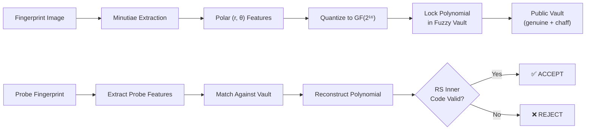
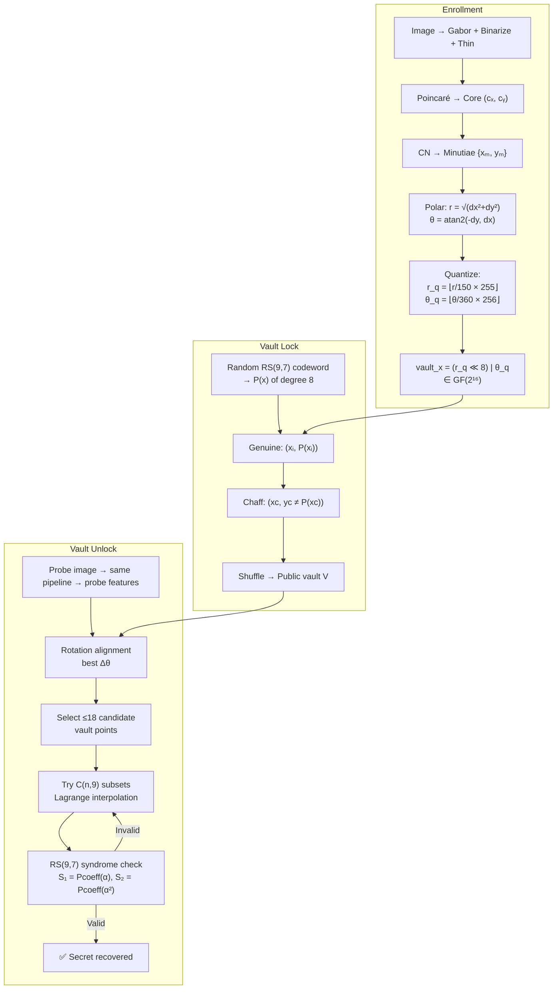

# rt_rs_fuzzy — Biometric Fuzzy Vault with Reed-Solomon ECC

## 1. What This Project Does (The Big Picture)

This system implements a **Fuzzy Vault** — a cryptographic construction that locks a secret (a polynomial) using noisy biometric data (fingerprint minutiae). The key insight:

> *A secret polynomial is hidden inside a cloud of points. Only someone who can identify enough genuine points (by presenting a matching fingerprint) can reconstruct the polynomial. An impostor sees genuine and chaff points mixed together and cannot distinguish them.*



---

## 2. Pipeline Architecture — The Six Modules

| Module | File | Role |
|--------|------|------|
| **Feature Extraction** | [updated_min_ext.py](file:///media/shivam/New%20Volume/Shivam/coursework/rt_rs_fuzzy/updated_min_ext.py) | Image → skeleton → pruned minutiae |
| **Enrollment** | [enrol_rt_rs.py](file:///media/shivam/New%20Volume/Shivam/coursework/rt_rs_fuzzy/enrol_rt_rs.py) | Minutiae → core-relative polar (r, θ) → quantized vault keys |
| **Vault Encoding** | [vault_encode_rs.py](file:///media/shivam/New%20Volume/Shivam/coursework/rt_rs_fuzzy/vault_encode_rs.py) | Generate secret polynomial, evaluate at genuine points, add chaff |
| **Vault Decoding** | [vault_decode_rs.py](file:///media/shivam/New%20Volume/Shivam/coursework/rt_rs_fuzzy/vault_decode_rs.py) | Probe → rotation alignment → candidate selection → polynomial reconstruction |
| **Evaluation** | [evaluate_rt_rs.py](file:///media/shivam/New%20Volume/Shivam/coursework/rt_rs_fuzzy/evaluate_rt_rs.py) | Genuine/impostor batch testing, GAR/FAR measurement |
| **Visualization** | [visualize_rt_rs.py](file:///media/shivam/New%20Volume/Shivam/coursework/rt_rs_fuzzy/visualize_rt_rs.py) | 6-panel PNG pipeline visualization |

---

## 3. Module 1 — Minutiae Extraction ([updated_min_ext.py](file:///media/shivam/New%20Volume/Shivam/coursework/rt_rs_fuzzy/updated_min_ext.py))

### 3.1 Preprocessing Pipeline

```
Raw grayscale image
  → Segmentation (Otsu + texture variance)
  → Enhancement (Hong-Wan-Jain normalization + multi-orientation Gabor filter bank)
  → Adaptive binarization (dark ridges become white foreground)
  → Connected-component cleaning (remove islands < 50 px)
  → Skeletonization (Zhang-Suen thinning via skimage)
  → Spur removal (trim 1-pixel-degree endpoints iteratively)
```

### 3.2 Poincaré Core Detection

The **singular core point** is found using the Poincaré index of the orientation field.

**Math:** Given the ridge orientation field $O(x, y)$ computed from gradients:

$$O(x,y) = \frac{1}{2} \arctan\left(\frac{2 \sum G_x G_y}{\sum G_x^2 - \sum G_y^2}\right)$$

For each block, the Poincaré index is computed by summing angular differences around a closed 8-neighbor loop:

$$\text{Poincaré} = \sum_{i=0}^{7} \delta_i, \quad \text{where } \delta_i = \big( O_{(i+1)\bmod 8} - O_i + \tfrac{\pi}{2} \big) \bmod \pi - \tfrac{\pi}{2}$$

- A **loop** (core) has Poincaré index ≈ π  
- A **delta** (tri-radius) has index ≈ −π  
- Normal ridge flow has index ≈ 0

The implementation at [lines 118–143](file:///media/shivam/New%20Volume/Shivam/coursework/rt_rs_fuzzy/updated_min_ext.py#L118-L143) computes this for every valid block and selects the candidate closest to the upper-center of the image.

### 3.3 Crossing Number Minutiae Extraction

On the thinned skeleton, each foreground pixel is classified by its **crossing number (CN)**:

$$CN = \frac{1}{2} \sum_{i=0}^{7} |P_{i} - P_{(i+1) \bmod 8}|$$

where $P_0 \ldots P_7$ are the 8 neighbors in clockwise order.

| CN | Meaning |
|----|---------|
| 1 | **Ridge ending** — one connected neighbor |
| 2 | Normal ridge continuation |
| 3 | **Bifurcation** — three branches diverge |

### 3.4 Multi-Stage Pruning

False minutiae are aggressively removed:

1. **Safe skeleton zone** — erode the skeleton footprint by `border_margin_px + fuse_radius` = 34px to discard noisy border minutiae
2. **Cluster deduplication** — if two minutiae are within 12px, keep only the bifurcation (higher CN preference)
3. **Structural validation**:
   - Endings must sit on a ridge at least `min_ridge_len` (15) pixels long
   - Bifurcations must have all 3 branches ≥ `min_branch_len` (14) pixels long, or connect to another junction
4. **Gap-pair elimination** — remove facing endings likely caused by a broken ridge (direction alignment check using dot products)

---

## 4. Module 2 — Enrollment & Quantization ([enrol_rt_rs.py](file:///media/shivam/New%20Volume/Shivam/coursework/rt_rs_fuzzy/enrol_rt_rs.py))

### 4.1 Polar Coordinate Transform

Each minutia at pixel $(x_m, y_m)$ is converted to core-relative polar coordinates:

$$r = \sqrt{(x_m - c_x)^2 + (y_m - c_y)^2}$$

$$\theta = \operatorname{atan2}(-(y_m - c_y),\ x_m - c_x) \bmod 360°$$

> [!IMPORTANT]
> The negative sign on $dy$ converts from image coordinates (y-down) to standard math coordinates (y-up). Minutiae beyond `MAX_RADIUS_PX = 150` pixels from the core are discarded.

### 4.2 Quantization to GF(2¹⁶)

The continuous $(r, \theta)$ pair is packed into a single 16-bit integer — an element of the Galois field $\text{GF}(2^{16})$:

$$r_q = \text{clamp}\!\left(\left\lfloor \frac{r}{150} \times 255 \right\rfloor,\ 0,\ 255\right) \quad \in [0, 255]$$

$$\theta_q = \left\lfloor \frac{\theta}{360} \times 256 \right\rfloor \bmod 256 \quad \in [0, 255]$$

$$\texttt{vault\_x} = (r_q \ll 8)\ |\ \theta_q$$

This gives a single 16-bit value where:
- **High byte** = quantized radial distance (0–255 → 0–150 px)
- **Low byte** = quantized angle (0–255 → 0°–360°)

Each `vault_x` becomes the **x-coordinate** when locking/unlocking the vault polynomial.

---

## 5. Module 3 — Vault Encoding ([vault_encode_rs.py](file:///media/shivam/New%20Volume/Shivam/coursework/rt_rs_fuzzy/vault_encode_rs.py))

### 5.1 The Fuzzy Vault Construction (Juels & Sudan, 2002)

The idea is:
1. Choose a secret polynomial $P(x)$ of degree $k-1$ over $\text{GF}(2^{16})$
2. Evaluate $P$ at each genuine minutia's vault key: $(x_i, P(x_i))$  
3. Add **chaff points** $(x_c, y_c)$ where $y_c \neq P(x_c)$
4. Shuffle everything into a single public set $V$

An attacker seeing $V$ cannot distinguish genuine from chaff points. But a legitimate user, presenting a matching fingerprint, can identify ~$k$ genuine points and use **Lagrange interpolation** to reconstruct $P$.

### 5.2 Inner Reed-Solomon Code on Coefficients

> [!TIP]
> The polynomial's 9 coefficients ($k = \text{degree} + 1 = 9$) are themselves structured as an **inner RS(9, 7) codeword** with 2 parity symbols. This lets the decoder verify/correct a reconstructed polynomial without storing a separate hash or CRC.

**How it works** ([lines 44–83](file:///media/shivam/New%20Volume/Shivam/coursework/rt_rs_fuzzy/vault_encode_rs.py#L44-L83)):

1. Generate 7 random message symbols in $\text{GF}(2^{16})$ (leading coeff ≠ 0)
2. Build the RS generator polynomial: $g(x) = \prod_{i=1}^{2} (x - \alpha^i)$ where $\alpha$ is the primitive element
3. Compute 2 parity symbols via systematic encoding: shift message by $x^2$, divide by $g(x)$, append remainder
4. The resulting 9-symbol codeword becomes the coefficients of the vault polynomial

### 5.3 Chaff Point Generation

```python
CHAFF_POINTS = 25  # default
```

For each chaff point:
- Random $x_c \in [0, 2^{16}-1]$, not duplicating any existing x
- Random $y_c \neq P(x_c)$ — guaranteeing it does **not** lie on the polynomial

The vault is shuffled, destroying ordering information.

### 5.4 Config Summary

| Parameter | Value | Meaning |
|-----------|-------|---------|
| `POLYNOMIAL_DEGREE` | 8 | Secret polynomial has 9 coefficients |
| `INNER_RS_PARITY_SYMBOLS` | 2 | RS(9,7) inner code for self-verification |
| `CHAFF_POINTS` | 25 | Noise points added to the vault |
| Field | GF(2¹⁶) | 65536-element Galois field |

---

## 6. Module 4 — Vault Decoding ([vault_decode_rs.py](file:///media/shivam/New%20Volume/Shivam/coursework/rt_rs_fuzzy/vault_decode_rs.py))

### 6.1 Rotation Alignment

Since fingerprints may be rotated between enrollment and probe, the decoder estimates a global rotation offset:

1. For every probe minutia $p$ and every vault point $v$, if their radii are close ($|r_p - r_v| \leq 12$ px):
   - Compute the implied rotation: $\Delta\theta = \theta_p - \theta_v \pmod{360°}$
2. Apply $\Delta\theta$ to **all** vault points and count how many probe features find a close match
3. Keep the rotation with the highest (match_count, −total_distance) score

### 6.2 Candidate Selection

Using the best rotation, scan all vault points:
- For each probe feature, find the vault point with the smallest Euclidean distance in rotated Cartesian space
- Accept if distance ≤ `R_TOLERANCE_PX` (12 px)
- Rank by distance, keep up to `MAX_DECODER_CANDIDATES` (18) points

### 6.3 Polynomial Reconstruction — Lagrange Interpolation

Given $k = 9$ candidate points believed to be genuine, reconstruct the polynomial using **Lagrange interpolation**:

$$P(x) = \sum_{j=0}^{k-1} y_j \prod_{\substack{m=0 \\ m \neq j}}^{k-1} \frac{x - x_m}{x_j - x_m}$$

All arithmetic is in $\text{GF}(2^{16})$.

The decoder tries many subsets of size $k$ from the candidates. For each:
1. Interpolate the polynomial
2. Check if degree < $k$
3. **Verify the inner RS code** (see below)
4. If RS-valid, count how many of all candidates lie on the polynomial

### 6.4 Inner RS Verification

The reconstructed polynomial's 9 coefficients are tested as an RS(9,7) codeword by evaluating at $\alpha^1$ and $\alpha^2$:

$$S_1 = P_{\text{coeff}}(\alpha), \quad S_2 = P_{\text{coeff}}(\alpha^2)$$

- If $S_1 = 0$ and $S_2 = 0$: **valid codeword** ✅
- If $S_1 \neq 0$: attempt **single-error correction**:
  - Error location: $X = S_2 / S_1$, find power $j$ such that $\alpha^j = X$
  - Error value: $Y = S_1 / X$
  - Correct: $c_j \leftarrow c_j - Y$
  - Re-verify syndromes

> [!NOTE]
> This inner RS code can correct 1 coefficient error and detect 2 errors. It acts as a "checksum on steroids" — the decoder knows immediately whether its interpolation result is plausible, without needing to store any secret hash.

### 6.5 Welch-Berlekamp (Optional)

When `ENABLE_WELCH_BERLEKAMP = True`, the decoder can handle **error-contaminated** candidate sets (some candidates are actually chaff). It solves the system:

$$Q(x_i) = E(x_i) \cdot y_i \quad \text{for all } i$$

where $\deg(Q) \leq k+e-1$, $\deg(E) \leq e$, and $e$ is the number of errors. Then $P = Q / E$.

Currently disabled by default since the interpolation + inner RS approach is faster for this dataset.

---

## 7. Module 5 — Evaluation ([evaluate_rt_rs.py](file:///media/shivam/New%20Volume/Shivam/coursework/rt_rs_fuzzy/evaluate_rt_rs.py))

### 7.1 Three Modes

| Mode | What it does |
|------|-------------|
| `single` | One vault + one probe → ACCEPT/REJECT |
| `genuine_batch` | Subject $i$'s vault vs Subject $i$'s impression-2 → measures **GAR** |
| `impostor_batch` | Subject $i$'s vault vs Subject $(i+1)$'s impression → measures **FAR** |

### 7.2 Metrics

$$\text{GAR} = \frac{\text{genuine accepts}}{\text{genuine total}}, \quad \text{FAR} = \frac{\text{impostor accepts}}{\text{impostor total}}$$

---

## 8. End-to-End Mathematical Flow

Here's the complete mathematical pipeline in one view:



---

## 9. Security Analysis

| Property | How it is achieved |
|----------|-------------------|
| **Template protection** | Raw minutiae are never stored; only `vault_x` values (quantized polar coords) are embedded among chaff |
| **Non-invertibility** | Given the public vault, an attacker must solve a combinatorial search: choose 9 genuine from ~(genuine + 25) shuffled points |
| **Renewability** | A new secret polynomial can be generated anytime; the old vault is discarded |
| **Noise tolerance** | Quantization bins and spatial tolerance (`R_TOLERANCE_PX = 12`) absorb fingerprint variation |
| **Self-verification** | Inner RS(9,7) code eliminates the need to store any hash of the secret |

> [!WARNING]
> The security level depends heavily on the ratio of genuine to chaff points. With only 25 chaff points and ~15 genuine, an attacker has $\binom{40}{9} ≈ 2^{27}$ subsets to try — moderate but not high security. Increasing `CHAFF_POINTS` strengthens the vault exponentially.
